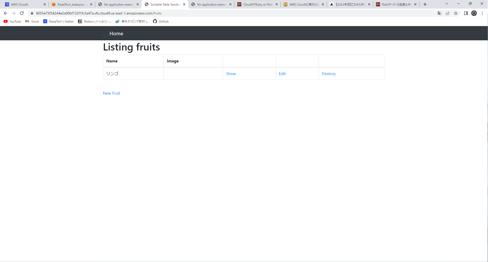
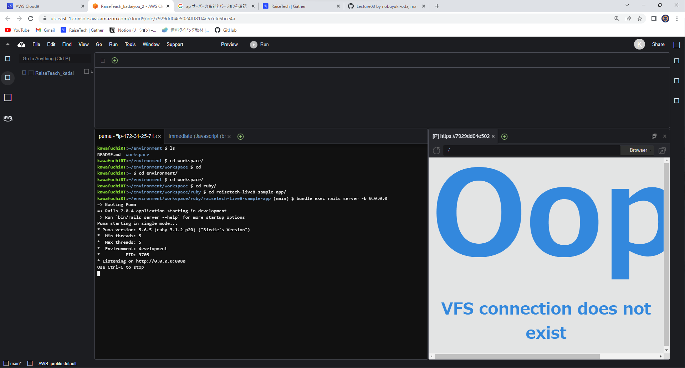
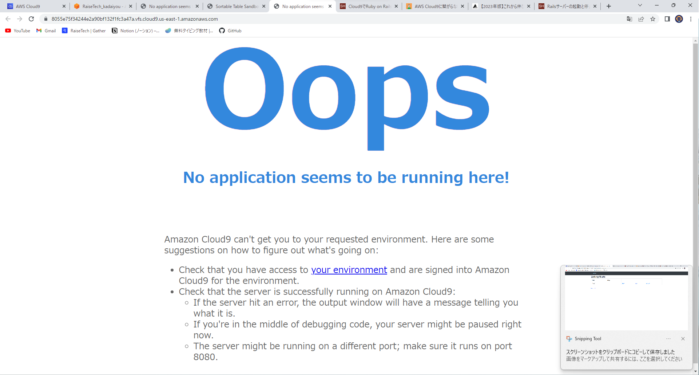
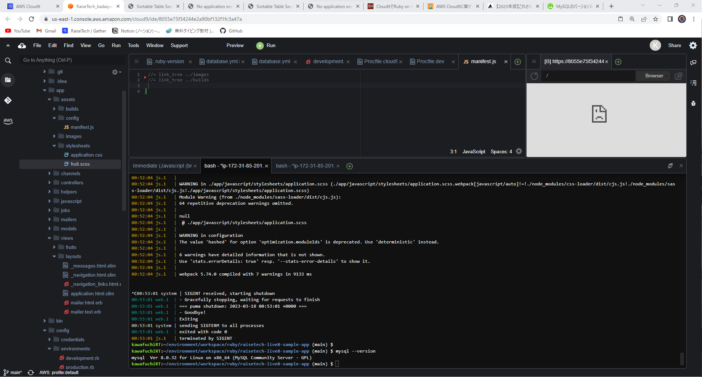
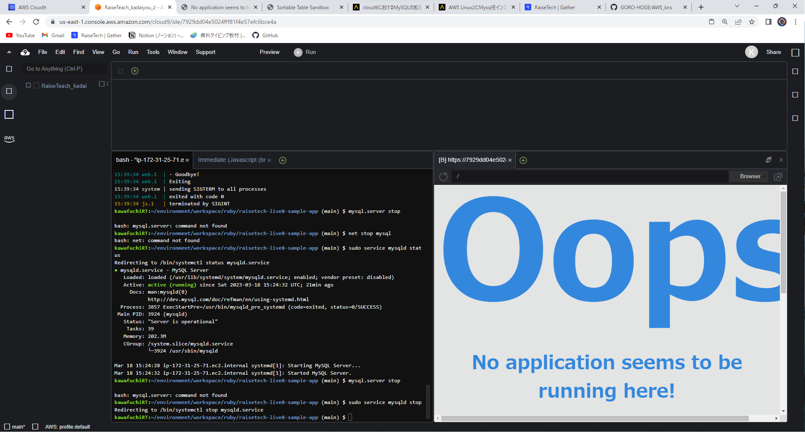

##第三回課題
1.ブラウズの起動

2.AP サーバーの名前とバージョンを確認

3.AP サーバーを終了させた場合

-ブラウズを開くことができませんでした。

4.サンプルアプリケーションで使った DB サーバー（DB エンジン）の名前と、今 Cloud9 で動作しているバージョンはいくつか確認

5.DB サーバーを終了させた場合

-起動することができませんでした。

:6.Rails の構成管理ツールの名前
-bundlerdです。

7.今回の課題から学んだこと
-今回の課題では、しっかりと順序を守ってサーバーを起動させないといけないということを学びました。また管理ツールのバージョン確認とバージョンを合わせないと動作しないという点に今後注意していきたいと思いました。
