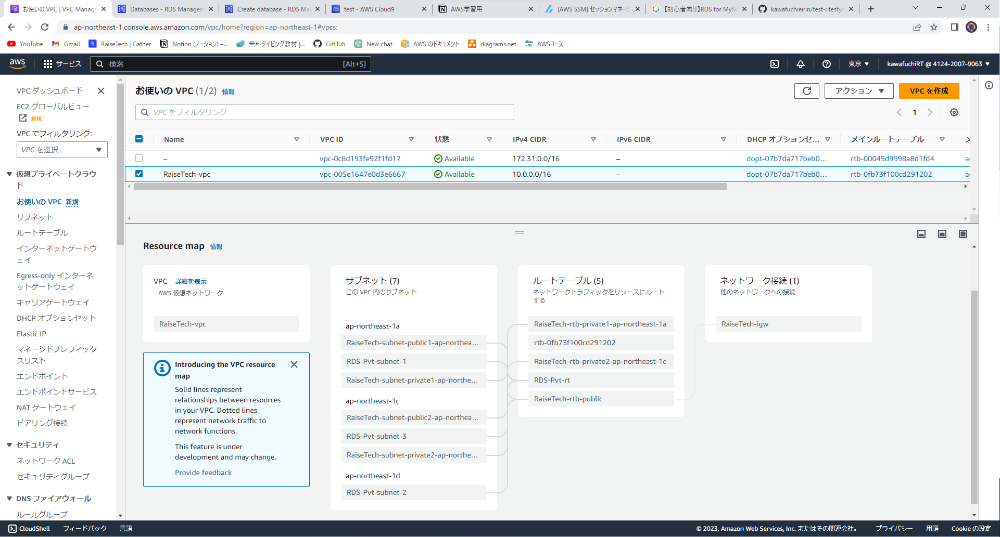
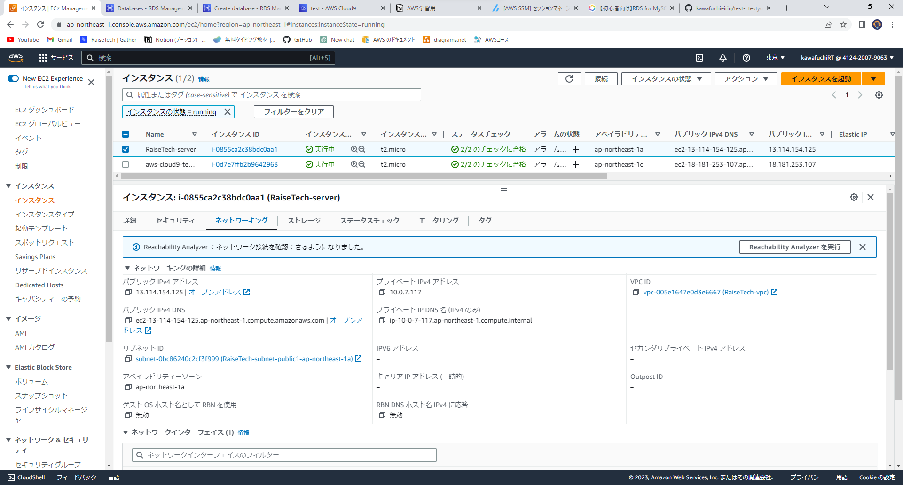
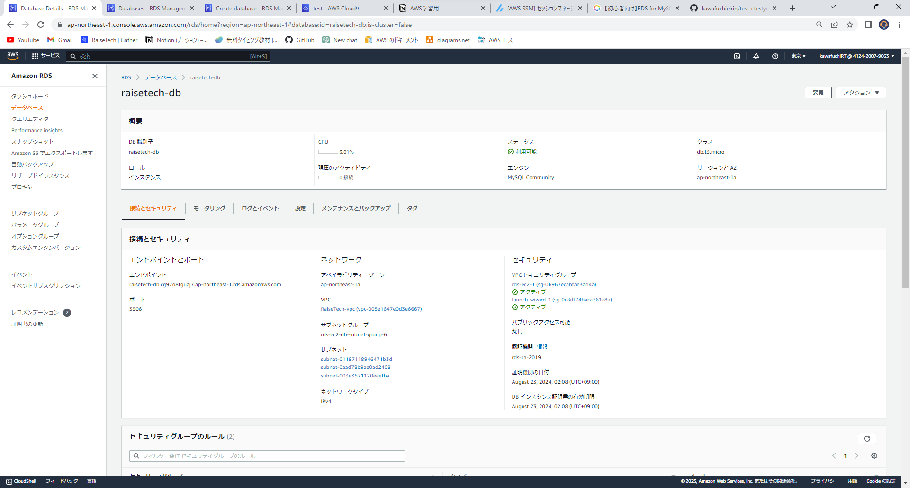

# 第4回の課題
　1.VPCの作成
　

 2.EC2の作成
　
　

 3.RDSの作成
　
 
 4.EC2をRDSに接続
　

# 第4回の課題で学んだことなど
 1.IPアドレスには、AWSの場合　動的：IPアドレス　静的：Elastic IPアドレス　の２種類があります。
　IPアドレスはインスタンスの起動アドレスが変化するので今後注意していきたいです。
　また：Elastic IPアドレスは使っていない場合に料金がかかるので使用後はすぐ解除を心がけたいです。
 2.パブリックサブネットとプライベートサブネットの違い
　パブリック：ネットワークに接続できるようインターネットゲートウェイがアタッチされている
　プライベート：基本的にネットに接続しないためデータベースなどのリソースを配置することが目的。
 3.今後の学習ではさらに複雑な構成を作ることになると思うので、ＡＷＳの図を練習して課題を明確にして進めていきたいです!！
