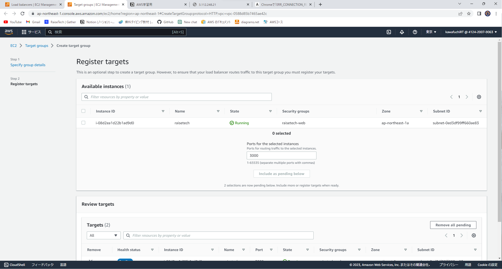
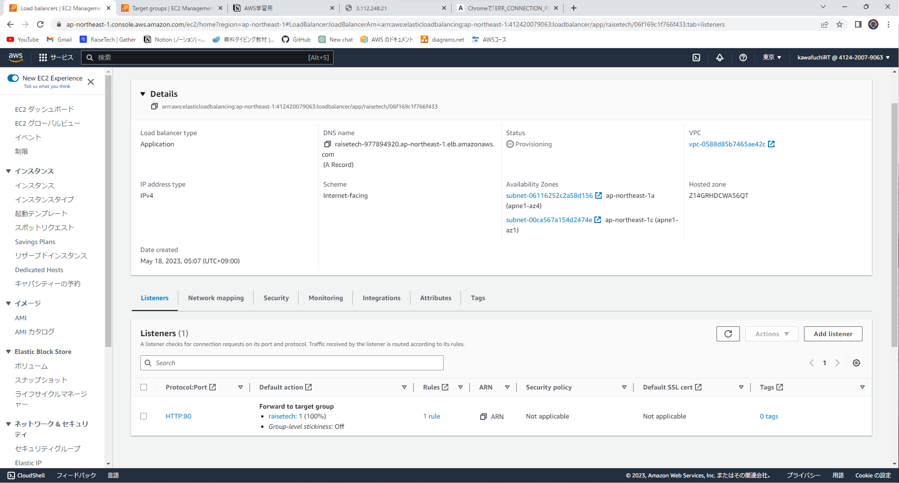
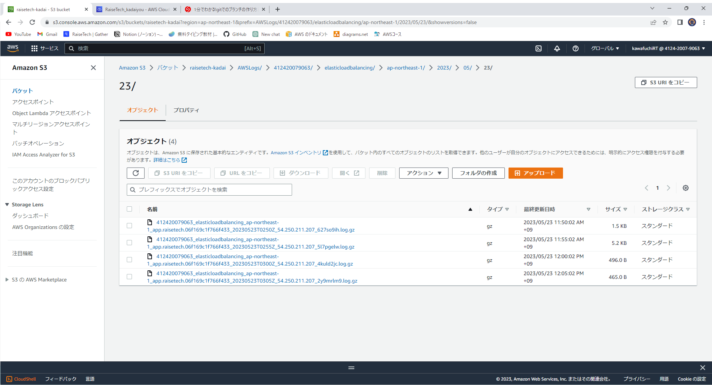

# 第5回課題
web３層構造を用いてアプリをデプロイ＋S3を使ってみる

## ・初めにVPC,EC2,RDSをAWS上に作成する
＊EC2のパブリック IP の自動割り当て有効化をしないと紐づけてくれないので注意

## ・EC2にSSHでログイン

## サンプルアプリの動作環境
**ruby**
3.1.2 
**Bundler**
2.3.14 
**Rails**
7.0.4 
**Node**
v17.9.1 
**yarn**
1.22.19
 
## ・パッケージのインストール
`＄sudo yum update -y`
 (-yはyes) 
パッケージ類をインストール
 
## ・gitをインストール
`$sudo yum install git　-y` 
git cloneをするためにgitをインストール
 
## ・rubyのインストール
`$git clone https://github.com/sstephenson/rbenv.git ~/.rbenv` 
`$git clone https://github.com/sstephenson/ruby-build.git ~/.rbenv/plugins/ruby-build` 
・パスの設定 
`$echo 'export PATH="$HOME/.rbenv/bin:$PATH"' >> ~/.bash_profile` 
`$echo 'eval "$(rbenv init -)"' >> ~/.bash_profile` 
`$source ~/.bash_profile` 
rubyバージョン管理のためにrbenvをインストール
 

## ・Node.jsインストール
`$curl -sL https://rpm.nodesource.com/setup_14.x | sudo bash -` 
`$sudo yum -y install nodejs` 
javascriptを使うためにインストール
 

## ・yarnインストール
`$curl -sL https://dl.yarnpkg.com/rpm/yarn.repo | sudo tee /etc/yum.repos.d/yarn.repo` 
`$sudo yum -y install yarn`
 
## ・サンプルアプリインストール
`$git clone gitのｈｔｔｐURL`
 
## ・データベースの接続
mysql install 
`$curl -fsSL https://raw.githubusercontent.com/MasatoshiMizumoto/raisetech_documents/main/aws/scripts/mysql_initialize.sh | sh` 
エラーMYSQLにつながらない 
→セキュリティグループ設定が設定されていなかった
 
・mysqlにログイン 
`$mysql -h RDSendpoint -u root -p` 
RDS作成時に設定したものを使う 
config databes yumlを編集 
データーベースのソケットの場所確認方法 
mysql --help | grep my.cnf
 
## ・app環境構築
`bin/setup` 
エラー　n error occurred while installing sassc (2.4.0), and Bundler cannot continue. 
→gcc-c++がなかったのでインストール 
`$yum install -y gcc-c++` 
エラーインストールがとまっている 
→インストールが進まなかったのでインスタンスタイプを変更 
エラー　railsがインストールされていない 
`$gem install rails` 
## ・railsの起動 
`$rails s -b 0.0.0.0` 
エラー　コンパイルができない 
→手動でプリコンパイル 
`$rails assets:precompile` 
 

## ・ALBの配置
エラー　config.hosts << "raisetech-977894920.ap-northeast-1.elb.amazonaws.com" 
→接続をすべて拒否していたのでconfig/environments/development.rbを編集
 

 

 
## ・nginxインストール
`$sudo amazon-linux-extras install nginx1`
 
## ・Nginx を起動
`$sudo systemctl start nginx`
 

 
## ・Unicorn をインストール
Rails アプリケーションがあるディレクトリの config ディレクトリに unicorn.rb というファイルを新規作成
 
Unicorn の起動・停止スクリプトを作成する
`$rails g task unicon` 
lib/tasks ディレクトリに unicorn.rake というファイルが生成ファイルを開いて編集
 
## ・Unicorn を起動
`$rake unicorn:start` 
Unicorn が起動しているかどうかを確認 
`$ps -ef | grep unicorn | grep -v grep`
 
## ・Nginx の設定ファイルを作成
エラー　権限がないためにviが編集できない 
→$sudo~とつける 
エラー　サーバーネームが長い 
→server name をlocalhostに変更
 
## nginx 起動
`$sudo systemctl start nginx` 
 

 
## nginx エラーの確認できるコマンド
`$sudo systemctl status nginx -l` 
`$nginx -t` 
エラーログを見る
 
## ・s3にALBのaccess　logを保存
ｓ３バケットを作成して権限を持つユーザーを作成 
バケットポリシーを作成 
ALBの設定からアクセスログの有効化を選択して適応する
 

 

今回はwebサーバーをstopして502のエラーが返ってきていました。 
304は変更なしの意味でした。
 
## ・今回作成した構成図
 
 
# 感想
今回の課題を通して感じた点として、エラーが出た際に１つの考え方ややり方に固執するのではなく様々な見方や方法た試してやってみることが大切だと感じました。
その際に構成図等のツールをうまく活用できるよう日頃から資格試験等の学習において構成図を書いて考える癖付けをしていきたいです。
またサーバーとの接続の際の使うポート番号や通信の仕組みの理解を深めていくべきだと感じました。

