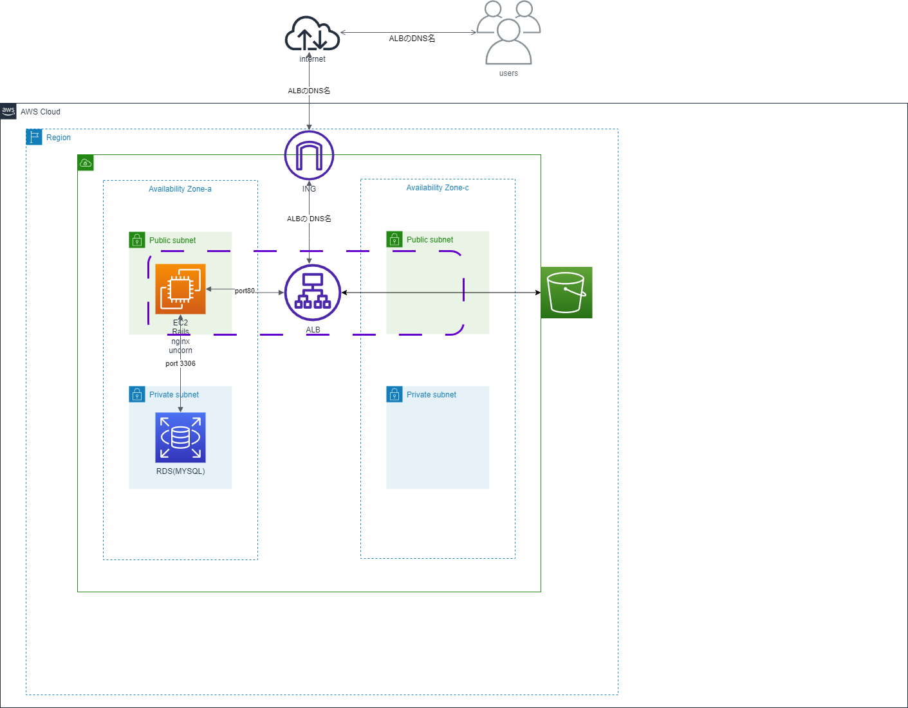

## 第７回課題

# これまでのリソースでの脆弱性と改善策

第５回で作成した構成です。

* EC２が１つしかないので大量accessにう対応できない。 
→マルチAZ構成を採用　異なるAZにEC２を配置して負荷を分散する

* ポート番号のｈｔｔｐは暗号化されていない 
→ACMでSSLを発行してHTTPS通信を使う。またHTTPを閉じる

* IAMユーザーの管理者権限がすべて（administrator）が付与されている 
→必要なもののみを付与する。「最小権限の法則」

* S3を外部との通信ができていた。 
→S3ゲートウェイエンドポイント構成をする　これにより外部との通信がなくなり安全に通信できる。

* git hubのトークンの認証の有効期限を期限なしにしている。 
→適切な期間で更新する。

# 感想等
第７回の学習では、システムにおけるセキュリティの基礎と脆弱性と対策について学ぶことができました。 
セキュリティとユーザビリティ（ユーザーの使い勝手の良さ）はトレードオフの関係にあり設計でそのバランスやコストの面を考えることの重要性を強く感じました。 
またセキュリティをたた強くすればよいのではなく、ユーザーの使いやすさも考慮して設計できるようさらに知識を身につけていきたいと思いました。

