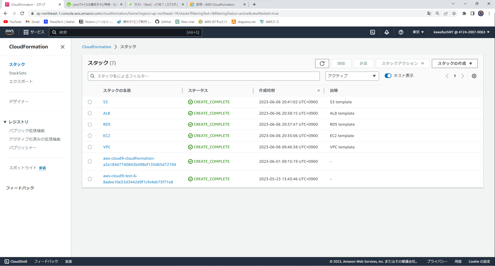
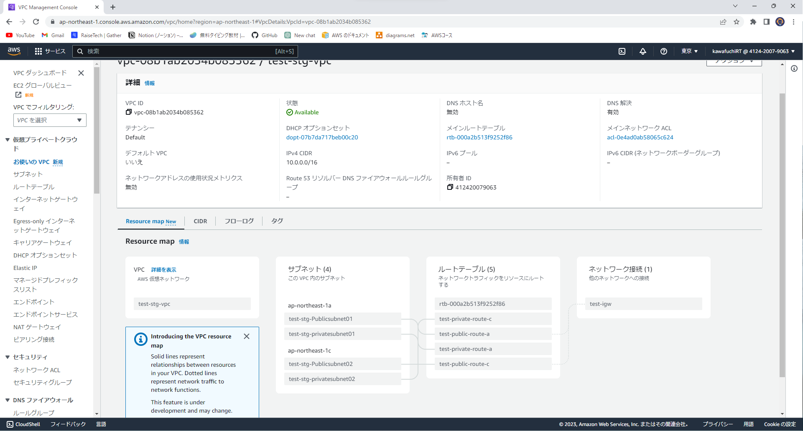
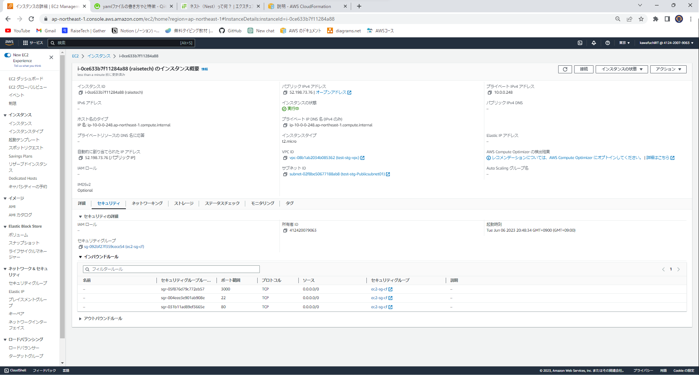
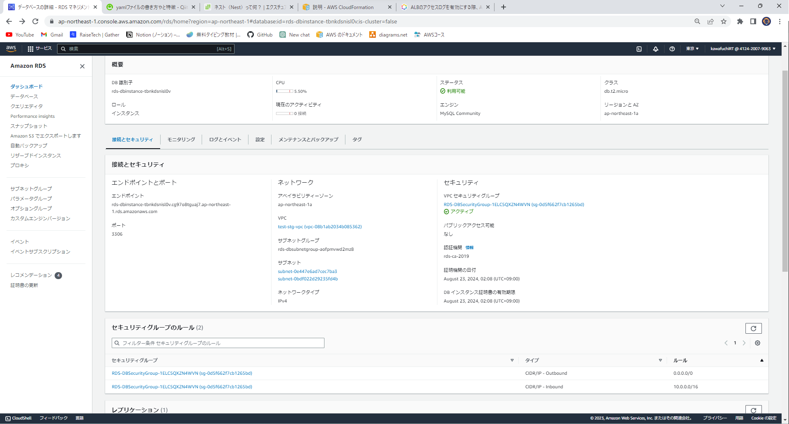
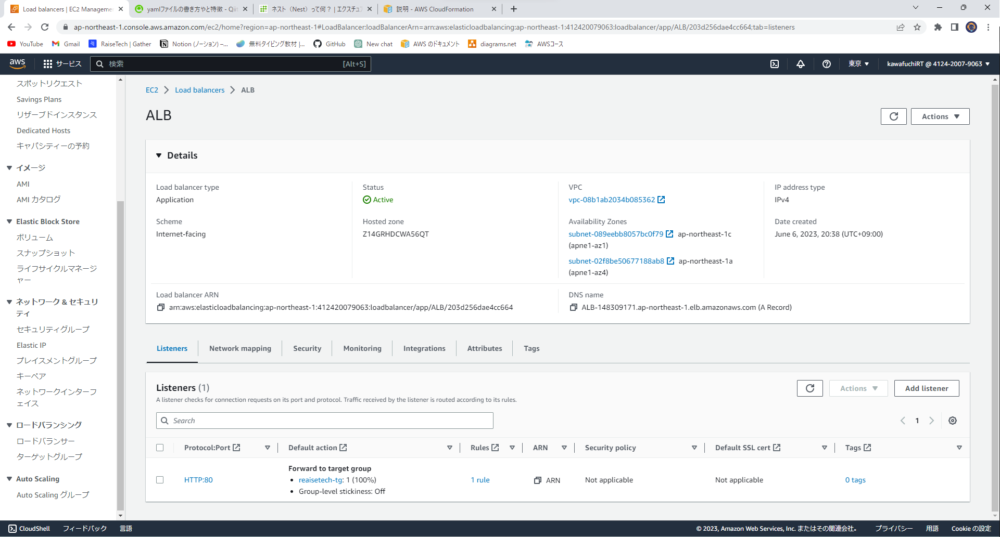
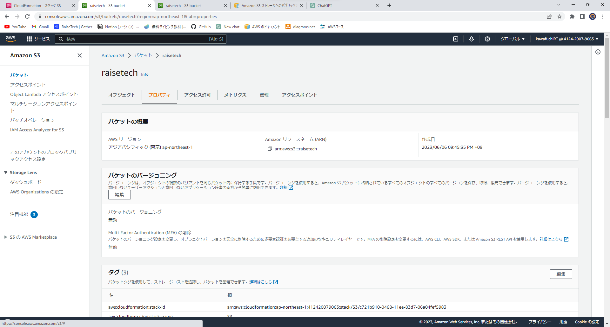
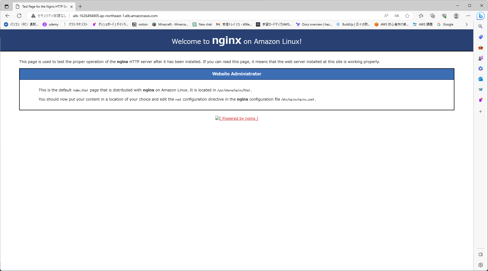
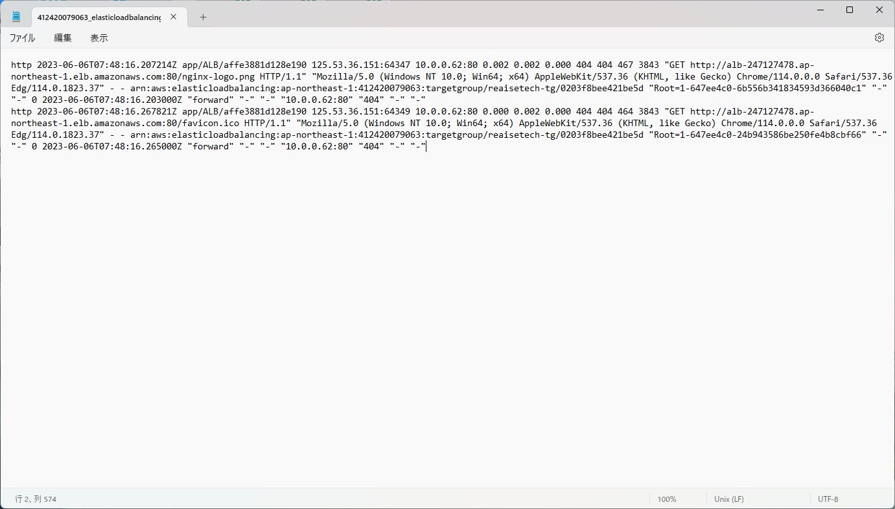

# 第１０回課題

## 学習した内容
1. cloudformationについて<br>
　→プロビジョニング（必要なものを準備すること、ITインフラの調達や設定など）およびサーバー設定のエリアにおける自動化および構成管理のためのサービスのこと。
2. yamlの書き方
   →:で「キー:値」のように区切って記述する<br>
　　name: 名前<br>
　　age: 年齢<br>
　　gender: 性別<br>
　　address: 住所
出力結果
 ```
{"name"=>"名前", "age"=>"年齢", "gender"=>"性別", "address"=>"住所"}
 ```
ハッシュに関しても半角スペースでインデントすることで、ネスト(プログラムの構造が再帰的に繰り返されて記述されること)させることが可能<br>
　　music:<br>
  　　rock: ロック<br>
 　 　pop: ポップス<br>
　 　 jaz: ジャズ<br>
出力結果
 ```
{"music"=>{"rock"=>"ロック", "pop"=>"ポップス", "jaz"=>"ジャズ"}}
 ```

3. templeteの書き方
AWSTemplateFormatVersion: 2010-09-09    
→お作法的な文   
Description: sample template    
→テンプレートの説明 
メタデータ  
→大量の AWS リソースに対して統一的にタグ設定    
Parameters: 
リソースの名前等の一部のみを変更して使いまわしたいときに使用    
Resources:  
→リソースを定義　＊cloudformation テンプレートリファレンスを参照 
 Outputs:   
→ほかのリソース使うための参照元を記述    

## 今回作ったAWSリソース
・cloudformationのスタック

・VPC

・EC2

・RDS

・ALB

・S3

・nginxの起動

・AＬＢのアクセスログ



## 今回作成したcloudformationのテンプレート
今回作成したテンプレートはcloudformation-templeteというファイルを作成しまとめて保管しています。

## 感想等
初めは、コードを見ても全く何もわからない状態からのスタートでした。
yamlの書き方やAWSの公式のリファレンスやインターネットにある様々な記事を見ていると少しづつではありますが内容を把握できるようになり成長を感じることができました。
また、スタックの作成の際、テンプレートのタイプミスやインシデントの違いでのエラーが多くあったので今後はtoolなどをうまく活用してミスを減らして行きたいです！
今回は様々な記事等を参考にテンプレートを作成しましたが、公式のリファレンスを活用してさらに誰もが読みやすいテンプレートを作れるように精進していきたいです。

