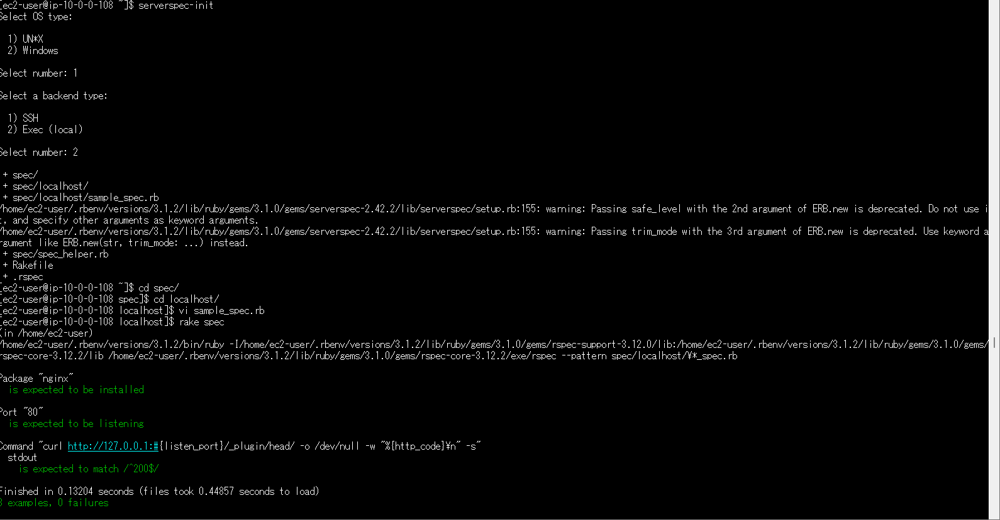

# 第11回課題
# 講義
・インフラのテスト 
確認するべきポイントは「仕様通り」である事 
使用するportが開いているかやサーバーが起動しているかなどをテストする。 

・テスト駆動開発(TestDrivenDevelopment:TDD) 
まずは設計に基づいて製品の仕様を満たす条件を確認するテストを先に作成するという手法 
テスト→にプロダクトを開発（テストが成功するように開発） 

・ServerSpec 
自動テストのツール 
rubyが使われていないとテストできない 
一度作成したテストコードは何度実行しても同じ結果を保証し、テストの内容が膨大であっても高速で完了が可能である。

# ServerSpec のテスト
前提条件 
rubyがインストールされていること 
Nginxがインストール済であること 
指定のポートがリッスン（通信待ち受け状態）であること 
テスト接続して動作すること 

## 感想等
今回はプロダクトを納品するにあたっての検査（テスト）について学ぶことができました。 
製品の品質にかかわる重要な部分だと思いますのでサンプルを自分で作成し検証してより知見を増やしたいと感じました。 
良い質問と回答ピックアップのところの（Q.読みやすいコードの書き方とは?）は課題を取り組む際に「前回何がやりたかったのかな？」いう時が多いので大変参考にしたいです。 
