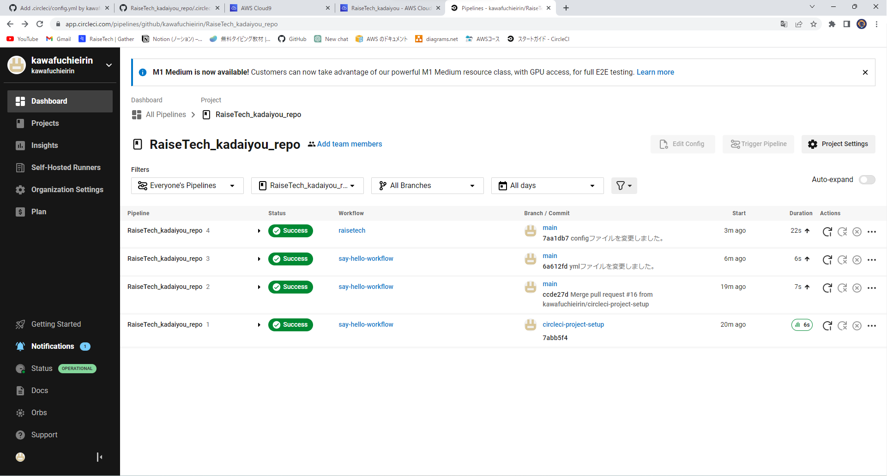
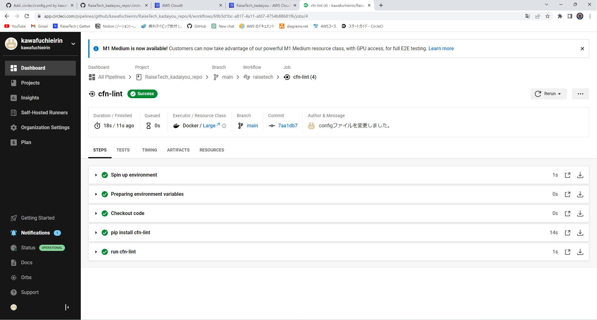
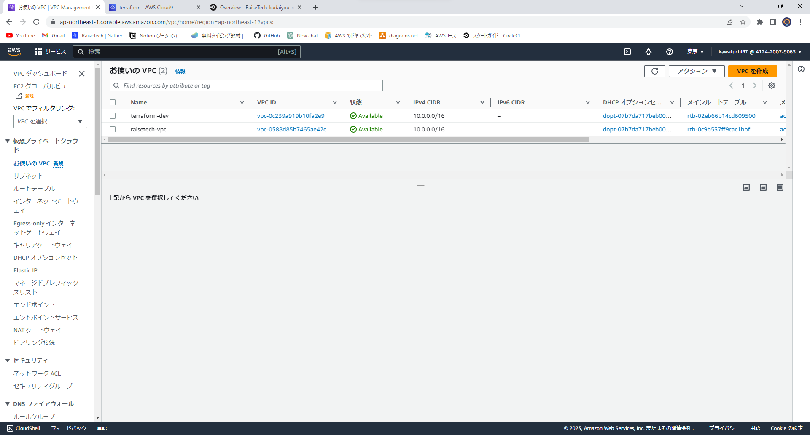
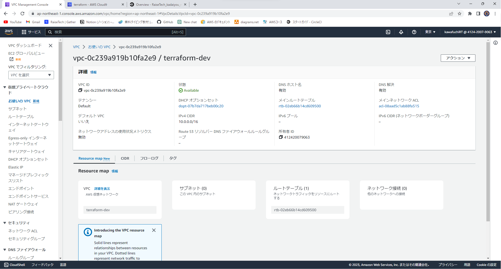
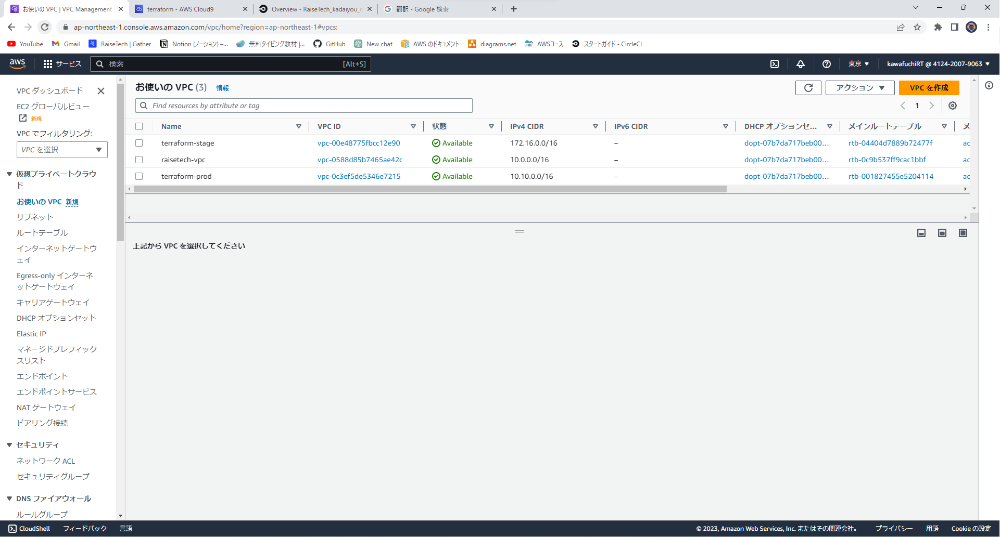

# 第１２回課題
## 講義の内容
・DevOps 
開発と運用のこと(連携が重要！) 
・CI/CD  
継続的な価値提供(ex 自動化) 
・CircleCIの見方 
構成 
バージョン:  　　　どの段階のCircleCIを使うか 
jobs:　　　　　　　実行させたい場夜を定義 
workflows:　　　　いつやるのか（ex pushの後） 

## 課題
・CircleCI　テスト 

・terraform 

今回は講座をもとにハンズオンに挑戦しました。 
次回はWEB３層構造にチャレンジしたいです。 

## つまずいたポイント
・.circleciのファイルが隠しファイルとなっていたため探すために時間がかかりました。 
→ls -a （隠しファイルもすべて確認できる。） 
・cloudfomationのテンプレートのRDSのymlファイルのｐｗがhardcodeとなっており書き換えが必要になってしまった。 
→'{{resolve:service-name:reference-key}}'動的な参照を使用しました。 
・ #!/bin/bash -eo pipefailcfn-lint -i W3002 -t cloudformation/*.yml　をエラーだと思い対策をしていました。 
→ほかのエラーをすべて解消すると消えました。 
・ファイルを編集する際に入力ができなくなっていました。（前回の編集を強制終了した場合に起こるもよう） 
→バックアップファイルを削除することで入力ができるようになりました。 
# 感想等
今回の課題では自動化（CircleCIの基本）について学びました。自動化することで人の手がかからなくなるため人的エラーや時間の節約ができるため積極的に取り組んでいきたいと思いました。
validate（構文チェック）を使うことで問題の個所などが一目でわかるため大幅に時間が短縮されました。VScodeを使用してcloudformationのテンプレートを作成しました。拡張機能を使い書くことでサポートが受けられコードを書きやすくなっており技術進歩を感じました。具体的にはymlファイルを作成→startでテンプレートの大枠が作られてました。まだまだ学ぶことは多いですが１つずつ蓄えていきたいです。
